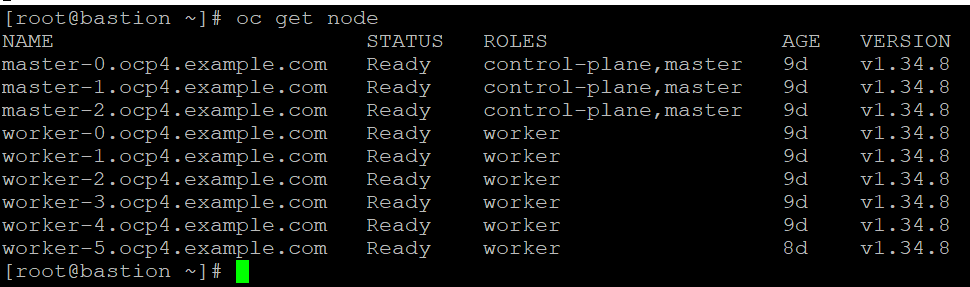
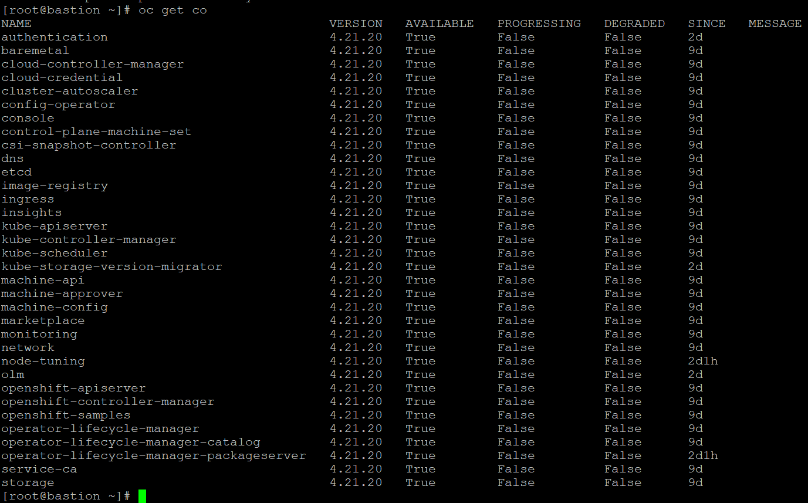
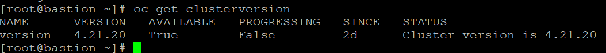
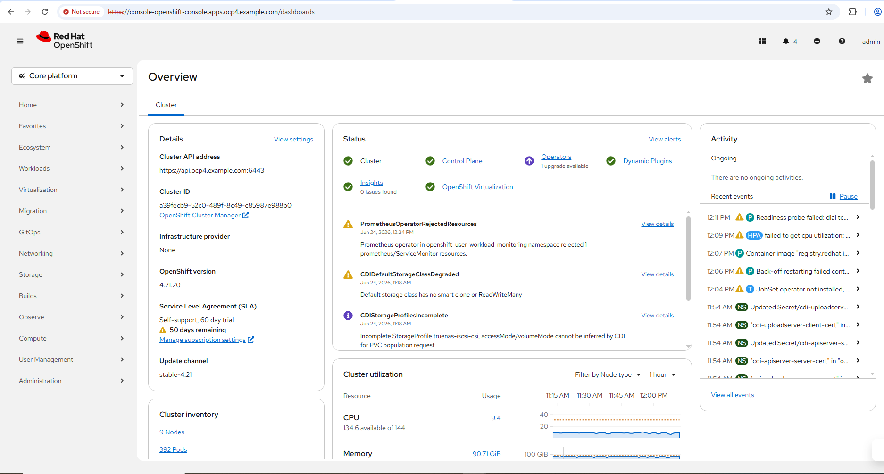
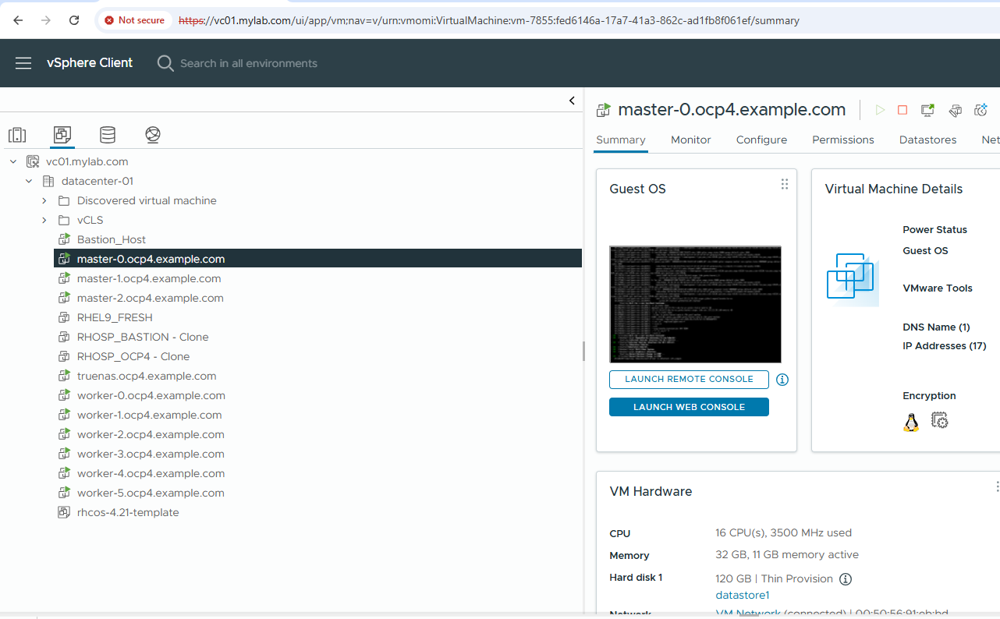

# OpenShift 4.21 UPI Production Cluster Installation on VMware ESXi

---

# Project Overview

This document describes the deployment of a Red Hat OpenShift Container Platform (OCP) 4.21 UPI Production Cluster on VMware ESXi.

The objective of this project is to build an enterprise-grade OpenShift environment suitable for learning production administration, virtualization, GitOps, storage integration and monitoring.

---

# Lab Environment

| Component | Details |
|-----------|---------|
| Platform | VMware ESXi |
| Installation Method | UPI |
| OpenShift Version | 4.21 |
| Masters | 3 |
| Workers | 6 |
| Bootstrap | 1 |
| Storage | TrueNAS CSI |
| Monitoring | Prometheus + Grafana |
| GitOps | ArgoCD |
| Virtualization | OpenShift Virtualization |

---

# Infrastructure

## Virtual Machines

| Host | Role |
|------|------|
| bootstrap | Bootstrap |
| master-0 | Control Plane |
| master-1 | Control Plane |
| master-2 | Control Plane |
| worker-0 | Compute |
| worker-1 | Compute |
| worker-2 | Compute |
| worker-3 | Compute |
| worker-4 | Compute |
| worker-5 | Compute |

---

# Major Components

- HAProxy
- DNS
- Ignition
- RHCOS
- Machine Config Operator
- Cluster Version Operator

---

# Installation Workflow

1. Prepare DNS
2. Configure HAProxy
3. Generate Ignition Files
4. Boot Bootstrap Node
5. Boot Master Nodes
6. Complete Bootstrap Process
7. Remove Bootstrap Node
8. Boot Worker Nodes
9. Approve CSRs
10. Verify Cluster Health

---

# Verification Commands

```bash
oc get nodes

oc get co

oc get clusterversion

oc get csr

oc get pods -A
```
---

# Cluster Verification

## Cluster Nodes

The following output confirms that all control plane and worker nodes are in the **Ready** state.



---

## Cluster Operators

All Cluster Operators are **Available=True**, **Progressing=False** and **Degraded=False**, indicating a healthy OpenShift cluster.



---

## Cluster Version

The cluster is running OpenShift Container Platform **4.21.20**.



---

## OpenShift Web Console

The OpenShift web console provides centralized administration and monitoring of the cluster.



---

## VMware Infrastructure

The OpenShift cluster is deployed on VMware ESXi with dedicated control plane and worker virtual machines.


---

# Expected Result

- All Cluster Operators Available
- All Nodes Ready
- No Degraded Operators
- Cluster Version Stable

---

# Lessons Learned

- Validate DNS before installation.
- Keep HAProxy configuration simple.
- Verify time synchronization.
- Approve pending CSRs immediately.
- Always verify Cluster Operators after installation.

---

# Status

✅ Successfully Deployed
