# 🚀 Red Hat OpenShift Container Platform 4.21 UPI Installation on VMware vSphere ESXi

> A production-style implementation guide for deploying Red Hat OpenShift Container Platform (OCP) 4.21 using the User-Provisioned Infrastructure (UPI) installation method on VMware vSphere ESXi.

---

## 📖 Overview

This project documents the complete deployment of **Red Hat OpenShift Container Platform (OCP) 4.21** on **VMware vSphere ESXi** using the **User-Provisioned Infrastructure (UPI)** installation model.

Unlike Installer-Provisioned Infrastructure (IPI), the UPI deployment model requires manual preparation of the underlying infrastructure, including networking, DNS, load balancing, virtual machine provisioning, and ignition configuration. This provides complete control over the deployment process and closely reflects real-world enterprise environments.

This guide is based on an actual production-style lab deployment and includes real commands, screenshots, validation procedures, and implementation notes.

---

## 📑 Table of Contents

- [Overview](#-overview)
- [Objectives](#-objectives)
- [High-Level Architecture](#-high-level-architecture)
- [Lab Environment](#-lab-environment)
- [Deployment Workflow](#-deployment-workflow)
- [Installation Guide](#-installation-guide)
  - [Step 01: Bastion Host Preparation](#step-01-bastion-host-preparation)
  - [Step 02: DNS Configuration](#step-02-dns-configuration)
  - [Step 03: Configure API & Apps VIP](#step-03-configure-api--apps-vip)
  - [Step 04: HAProxy Installation & Configuration](#step-04-haproxy-installation--configuration)
  - [Step 05: Create OpenShift Installation Assets](#step-05-create-openshift-installation-assets)
  - [Step 06: Deploy RHCOS Virtual Machines](#step-06-deploy-rhcos-virtual-machines)
  - [Step 07: Inject Ignition Configuration](#step-07-inject-ignition-configuration)
  - [Step 08: Bootstrap Node Initialization](#step-08-bootstrap-node-initialization)
  - [Step 09: Bootstrap Completion](#step-09-bootstrap-completion)
  - [Step 10: Deploy Control Plane Nodes](#step-10-deploy-control-plane-nodes)
  - [Step 11: Deploy Worker Nodes](#step-11-deploy-worker-nodes)
  - [Step 12: Certificate Signing Request (CSR) Approval](#step-12-certificate-signing-request-csr-approval)
  - [Step 13: Verify Cluster Nodes](#step-13-verify-cluster-nodes)
  - [Step 14: Verify Cluster Operators](#step-14-verify-cluster-operators)
  - [Step 15: Verify Cluster Version](#step-15-verify-cluster-version)
  - [Step 16: Access OpenShift Web Console](#step-16-access-openshift-web-console)
- [Final Validation](#-final-validation)
- [Lessons Learned](#-lessons-learned)
- [References](#-references)

---

## 🎯 Objectives

- Deploy Red Hat OpenShift Container Platform 4.21 using the User-Provisioned Infrastructure (UPI) installation model.
- Configure VMware vSphere infrastructure for bootstrap, control plane, and worker nodes.
- Configure Windows Active Directory DNS and external HAProxy load balancing.
- Generate and inject Ignition configuration files.
- Deploy and validate a highly available OpenShift cluster.
- Document every deployment phase using commands, screenshots, validation checks, and production best practices.

---

## 🏗️ High-Level Architecture

```text
Windows AD DNS
        │
        │
Bastion Host ───── HAProxy
        │
        │
VMware ESXi Cluster
        │
 ┌───────────────┐
 │ Bootstrap VM  │
 └───────────────┘
        │
 ┌───────────────┐
 │ Master-0      │
 │ Master-1      │
 │ Master-2      │
 └───────────────┘
        │
 ┌───────────────┐
 │ Worker-0      │
 │ Worker-1      │
 └───────────────┘
        │
   OpenShift 4.21
```


---

## 🖥️ Lab Environment

| Component | Details |
|-----------|---------|
| OpenShift Version | 4.21.21 |
| Kubernetes Version | v1.34.x |
| Deployment Method | User-Provisioned Infrastructure (UPI) |
| Hypervisor | VMware vSphere ESXi |
| Operating System | Red Hat Enterprise Linux 9 |
| DNS | Windows Active Directory DNS |
| Load Balancer | HAProxy |
| Storage | TrueNAS CSI |
| Container Runtime | CRI-O |
| Network | Static IP Addressing |

---

## 📋 Deployment Workflow

```text
Bastion Host Preparation
        │
        ▼
DNS Configuration
        │
        ▼
API & Apps VIP Configuration
        │
        ▼
HAProxy Installation & Configuration
        │
        ▼
Create OpenShift Installation Assets
        │
        ▼
Deploy Bootstrap Node
        │
        ▼
Deploy Control Plane Nodes
        │
        ▼
Bootstrap Completion
        │
        ▼
Deploy Worker Nodes
        │
        ▼
Approve Certificate Signing Requests
        │
        ▼
Cluster Validation
        │
        ▼
Access OpenShift Web Console
```

---

## 🚀 Installation Guide

## Step 01: Bastion Host Preparation

### Objective

Prepare the bastion host by installing the required packages, enabling time synchronization, and installing the OpenShift CLI (`oc`) and installer (`openshift-install`).

---

### Install Required Packages

```bash
sudo dnf update -y

sudo dnf install -y \
wget \
curl \
tar \
git \
jq \
haproxy \
bind-utils \
chrony \
python3
```

### Enable Time Synchronization

```bash
sudo systemctl enable --now chronyd

chronyc sources -v

timedatectl
```

### 📷 Screenshot

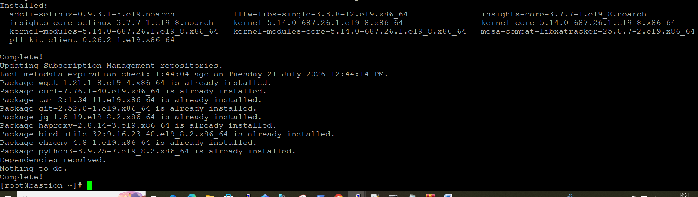

> **Figure 2.** Required packages successfully installed on the bastion host.
---

### Download OpenShift Client & Installer

Download the **OpenShift Client (`oc`)** and **OpenShift Installer (`openshift-install`)** binaries from the official Red Hat mirror. Ensure that both binaries match the target OpenShift cluster version.

> **Note:** Download the OpenShift Client and Installer versions that match your target OpenShift cluster version.

### Commands

```bash
cd /tmp

wget https://mirror.openshift.com/pub/openshift-v4/x86_64/clients/ocp/4.21.2/openshift-client-linux.tar.gz

wget https://mirror.openshift.com/pub/openshift-v4/x86_64/clients/ocp/4.21.2/openshift-install-linux.tar.gz
```

### Output

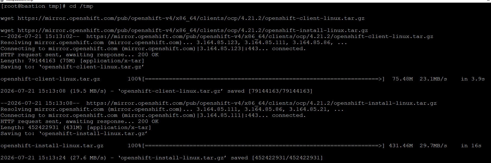

> **Figure 3.** Downloading the OpenShift Client (`oc`) and OpenShift Installer binaries from the official Red Hat mirror.

The OpenShift Client and Installer archives were successfully downloaded from the official Red Hat mirror. These binaries will be extracted and installed on the bastion host in the next step.

### Notes

- Download the client and installer only from the official Red Hat mirror.
- Ensure both binaries match the target OpenShift cluster version.
- Keep the downloaded archives in a temporary working directory before extraction.

---

### Extract the Archives

```bash
tar -xvf openshift-client-linux.tar.gz

tar -xvf openshift-install-linux.tar.gz
```

📷 **Screenshot**
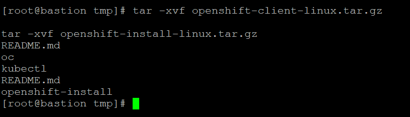

> **Figure 4.** Extracting the OpenShift Client and Installer archives.

---

### Install the Binaries

```bash
sudo mv oc kubectl openshift-install /usr/local/bin/

sudo chmod +x \
/usr/local/bin/oc \
/usr/local/bin/kubectl \
/usr/local/bin/openshift-install
```

📷 **Screenshot**

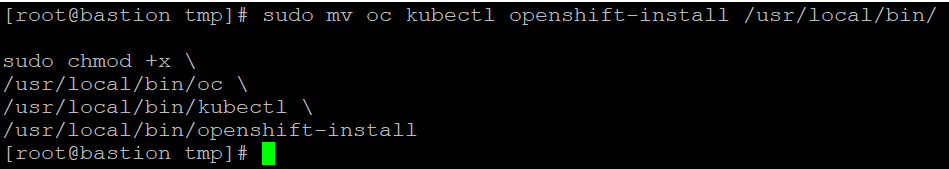

> **Figure 5.** Installing the OpenShift Client, `kubectl`, and OpenShift Installer into `/usr/local/bin`.

---

### Verify Installation

Verify that both the OpenShift Client (`oc`) and OpenShift Installer (`openshift-install`) are installed successfully and that their versions match the target OpenShift release.

### Commands

```bash
oc version --client

openshift-install version
```

### Expected Output

- OpenShift Client Version: **4.21.2**
- OpenShift Installer Version: **4.21.2**

### Output

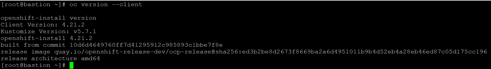

> **Figure 6.** Verification of the installed OpenShift Client (`oc`) and OpenShift Installer versions.

The output confirms that both the OpenShift Client and Installer have been installed successfully and are running the same release version. Using matching versions helps ensure compatibility throughout the cluster installation process.

### Notes

- Always use the same version of the OpenShift Client and Installer.
- Verify the binaries before generating installation assets.
- Store the binaries in `/usr/local/bin` so they are accessible system-wide.
---

### Verification Checklist

- ✅ Required packages installed
- ✅ Chrony service enabled
- ✅ Time synchronized
- ✅ OpenShift Client installed
- ✅ OpenShift Installer installed
- ✅ Correct OpenShift version verified


### Step 02: DNS Configuration

Configure the required DNS records in **Windows Active Directory DNS** before starting the OpenShift installation. Proper DNS resolution is essential for communication between the bootstrap node, control plane nodes, worker nodes, and the OpenShift API.

### Configure DNS Records

Create the following DNS records in the DNS Manager.

| Record | Type | Description |
|--------|------|-------------|
| api.ocp4.example.com | A | OpenShift API Virtual IP |
| api-int.ocp4.example.com | A | Internal OpenShift API Virtual IP |
| *.apps.ocp4.example.com | A | OpenShift Applications Virtual IP |
| bootstrap.ocp4.example.com | A | Bootstrap Node |
| master-0.ocp4.example.com | A | Control Plane Node 0 |
| master-1.ocp4.example.com | A | Control Plane Node 1 |
| master-2.ocp4.example.com | A | Control Plane Node 2 |
| worker-0.ocp4.example.com | A | Worker Node 0 |
| worker-1.ocp4.example.com | A | Worker Node 1 |

### Output

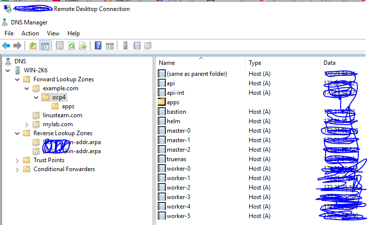

> **Figure 7.** Windows Active Directory DNS records configured for the OpenShift cluster.

---

### Validate DNS Resolution

Verify that all DNS records resolve successfully from the bastion host.

### Commands

```bash
nslookup api.ocp4.example.com

nslookup api-int.ocp4.example.com

nslookup bootstrap.ocp4.example.com

nslookup master-0.ocp4.example.com

nslookup master-1.ocp4.example.com

nslookup master-2.ocp4.example.com

nslookup worker-0.ocp4.example.com

nslookup worker-1.ocp4.example.com
```

### Output

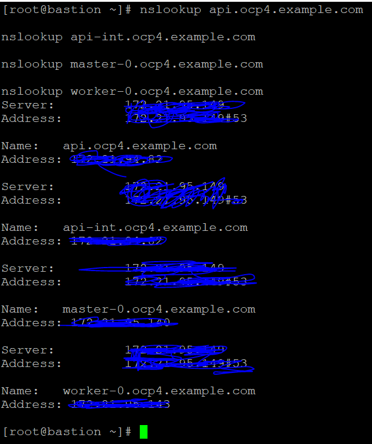

> **Figure 8.** Successful DNS resolution of the OpenShift API, bootstrap, control plane, and worker nodes from the bastion host.

The successful `nslookup` results confirm that all required DNS records are correctly configured and reachable from the bastion host. This verification must be completed before generating the OpenShift installation assets.

### Notes

- Verify all DNS records before starting the installation.
- Ensure both API and Applications Virtual IPs resolve correctly.
- Confirm that all cluster node hostnames resolve to their assigned static IP addresses.
- Any DNS resolution failure should be corrected before proceeding with the OpenShift installation.

---

### Step 03: Configure API & Applications Virtual IP (VIP)

Configure the **API Virtual IP (API VIP)** and **Applications Virtual IP (Apps VIP)** that will be used by the OpenShift cluster. The API VIP provides access to the OpenShift API server, while the Apps VIP is used to expose application routes.

### Virtual IP Configuration

| Virtual IP | Purpose |
|------------|---------|
| API VIP | OpenShift API Endpoint |
| Apps VIP | OpenShift Application Routes |

> **Example**
>
> API VIP : `192.168.0.82`  
> Apps VIP : `192.168.0.83`

---

### Verify Virtual IP Configuration

Verify that both Virtual IP addresses are correctly configured and reachable.

### Commands

```bash
ip addr

ping -c 4 192.168.0.82

ping -c 4 192.168.0.83
```

> **Note:** Replace the example IP addresses with the actual API VIP and Apps VIP configured in your environment.

### Output

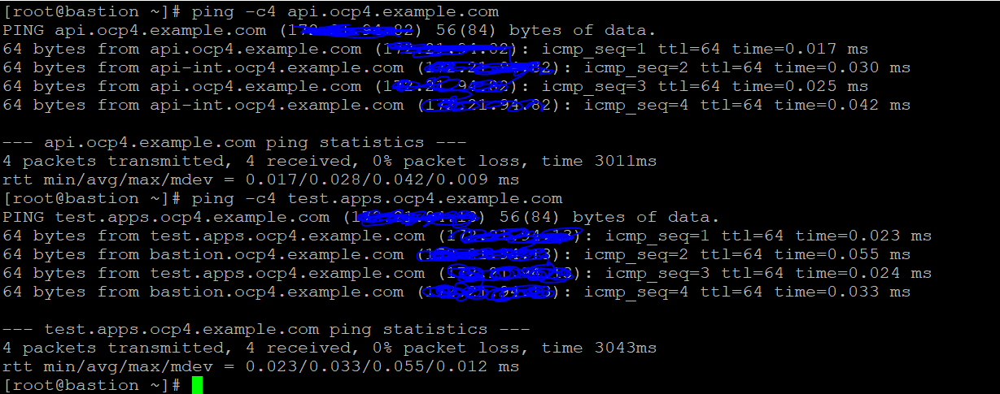

> **Figure 9.** Verification of the configured API VIP and Applications VIP.

The successful verification confirms that both Virtual IP addresses are correctly configured and reachable before proceeding with the HAProxy configuration.

### Notes

- Configure the API VIP and Apps VIP before starting the cluster installation.
- Ensure both VIPs belong to the same network as the OpenShift nodes.
- Verify that no other device is using these IP addresses.
- Use dedicated Virtual IPs for production deployments.
---

### Step 04: HAProxy Installation & Configuration

HAProxy is used as the external load balancer for the OpenShift cluster. It distributes incoming traffic to the API server, Machine Config Server (MCS), and Ingress Router, ensuring high availability and reliable access to the cluster.

### Install HAProxy

Install the HAProxy package on the bastion host.

### Commands

```bash
sudo dnf install -y haproxy
```

---

### Configure HAProxy

Update the HAProxy configuration file with the required frontend and backend definitions for the OpenShift API, Machine Config Server, and Ingress Router.

### Commands

```bash
sudo vi /etc/haproxy/haproxy.cfg
```

### Output

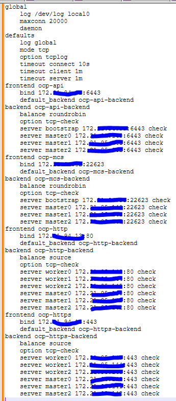

> **Figure 10.** HAProxy configuration for the OpenShift API, Machine Config Server, and Ingress Router.

---

### Validate HAProxy Configuration

Verify the configuration syntax before starting the HAProxy service.

### Commands

```bash
sudo haproxy -c -f /etc/haproxy/haproxy.cfg
```

### Output

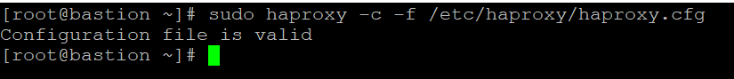

> **Figure 11.** Successful validation of the HAProxy configuration.

---

### Enable and Start HAProxy

Enable the HAProxy service to start automatically during system boot and start the service.

### Commands

```bash
sudo systemctl enable --now haproxy

sudo systemctl status haproxy
```

### Output

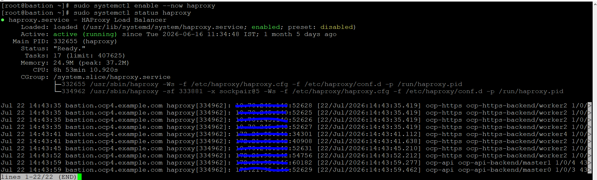

> **Figure 12.** HAProxy service running successfully on the bastion host.

The successful validation and running service status confirm that HAProxy is ready to provide load balancing for the OpenShift cluster installation.

### Notes

- Always validate the configuration before restarting HAProxy.
- Ensure the API VIP and Apps VIP are configured correctly.
- Confirm that backend server IP addresses match the bootstrap, control plane, and worker nodes.
- Allow the required ports through the firewall if it is enabled.

---

### Step 05: Create OpenShift Installation Assets

Create the OpenShift installation directory and generate the installation assets required to deploy the cluster.

### Create Installation Directory

Create a working directory for the OpenShift installation.

### Commands

```bash
mkdir ~/ocp-install

cd ~/ocp-install
```

---

### Create the Installation Configuration

Generate the `install-config.yaml` file using the OpenShift Installer.

### Commands

```bash
openshift-install create install-config
```

Complete the interactive prompts by providing:

- Cluster Name
- Base Domain
- Platform (None / UPI)
- Pull Secret
- SSH Public Key

### Output

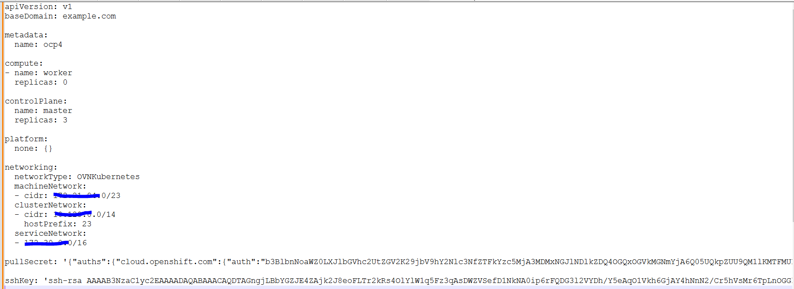

> **Figure 13.** Generating the `install-config.yaml` file using the OpenShift Installer.

---

### Review the Installation Configuration

Verify the generated installation configuration.

### Commands

```bash
cat install-config.yaml
```

### Output

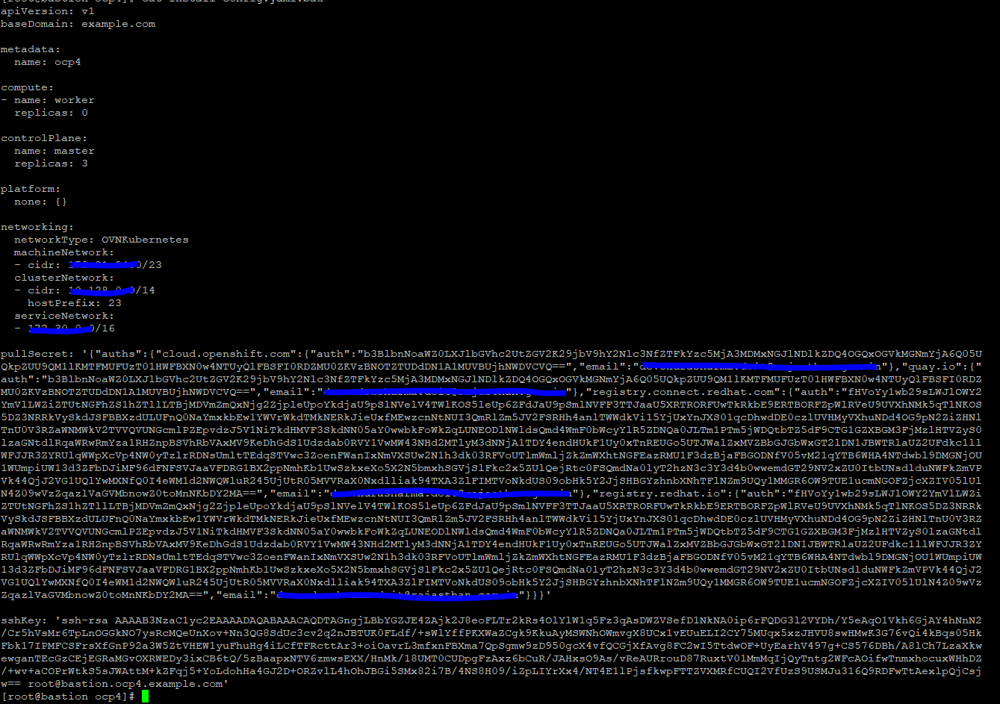

> **Figure 14.** Generated `install-config.yaml` containing the cluster configuration.

---

### Generate Installation Manifests

Generate the Kubernetes manifests required for the installation.

### Commands

```bash
openshift-install create manifests
```

### Output

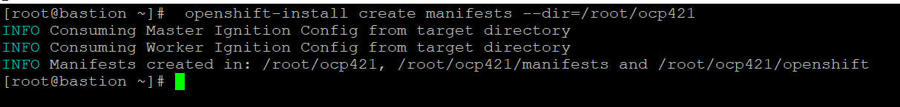

> **Figure 15.** Successfully generated the OpenShift installation manifests.

---

### Generate Ignition Configuration Files

Generate the Ignition configuration files for the bootstrap, control plane, and worker nodes.

### Commands

```bash
openshift-install create ignition-configs
```

### Output

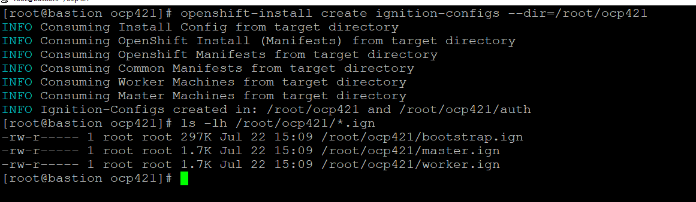

> **Figure 16.** Successfully generated the Ignition configuration files.

The generated installation assets include the `install-config.yaml`, Kubernetes manifests, and Ignition configuration files required for deploying the OpenShift cluster.

### Notes

- Keep the `install-config.yaml` file secure, as it contains sensitive information.
- Back up the generated Ignition files before deployment.
- Do not modify the generated Ignition files unless required.
- Verify all generated files before booting the cluster nodes.

---

### Step 06: Deploy RHCOS Virtual Machines

Deploy the bootstrap, control plane, and worker virtual machines using the generated Red Hat Enterprise Linux CoreOS (RHCOS) Ignition configuration files. These virtual machines form the foundation of the OpenShift cluster.

### Create Virtual Machines

Create the required virtual machines on the VMware vSphere ESXi host with the appropriate CPU, memory, disk, and network configuration.

| Virtual Machine | Role |
|-----------------|------|
| bootstrap | Bootstrap Node |
| master-0 | Control Plane Node |
| master-1 | Control Plane Node |
| master-2 | Control Plane Node |
| worker-0 | Worker Node |
| worker-1 | Worker Node |

### Output

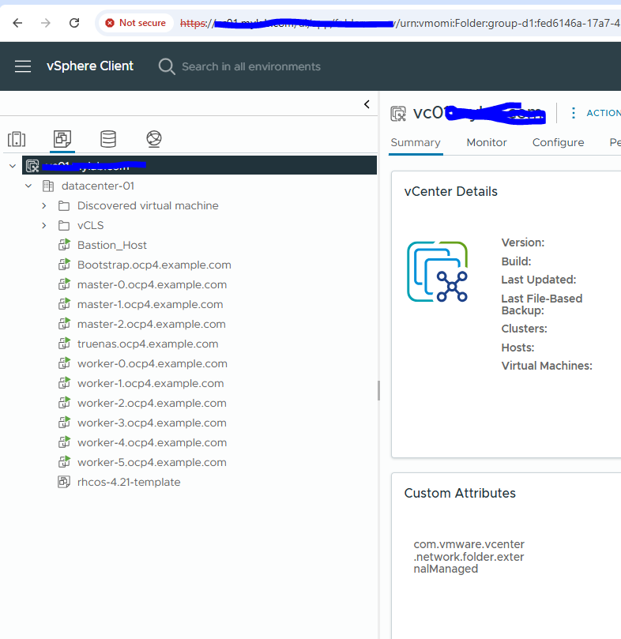

> **Figure 17.** Red Hat Enterprise Linux CoreOS virtual machines created on VMware vSphere ESXi.

---

### Attach Ignition Configuration

Configure each virtual machine with its corresponding Ignition configuration.

| Virtual Machine | Ignition File |
|-----------------|---------------|
| bootstrap | bootstrap.ign |
| master-0 | master.ign |
| master-1 | master.ign |
| master-2 | master.ign |
| worker-0 | worker.ign |
| worker-1 | worker.ign |

### Output

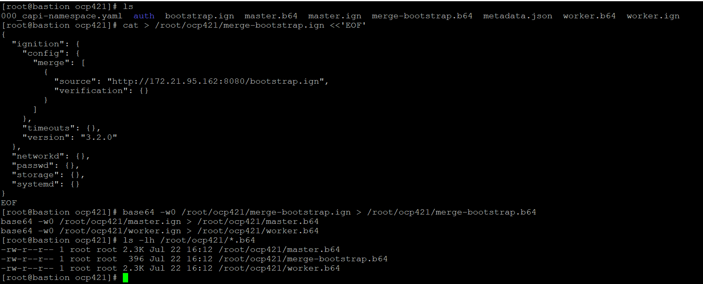

> **Figure 18.** Ignition configuration attached to each virtual machine.

---

### Power On the Virtual Machines

Start the virtual machines in the following order:

1. Bootstrap
2. Master-0
3. Master-1
4. Master-2
5. Worker-0
6. Worker-1

### Output

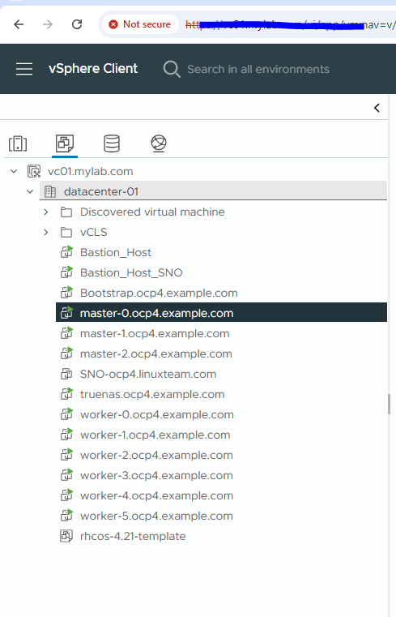

> **Figure 19.** All Red Hat Enterprise Linux CoreOS virtual machines powered on successfully.

The successful deployment of the bootstrap, control plane, and worker nodes completes the infrastructure required for the OpenShift installation.

### Notes

- Verify that every virtual machine is connected to the correct network.
- Ensure the appropriate Ignition file is assigned to each virtual machine.
- Confirm that all virtual machines boot successfully before continuing.
- Verify network connectivity between all cluster nodes.

---

### Step 07: Inject Ignition Configuration

Configure each Red Hat Enterprise Linux CoreOS (RHCOS) virtual machine with the appropriate Ignition configuration. During boot, the Ignition file provisions the operating system with the required OpenShift configuration, networking, certificates, and MachineConfig settings.

### Configure Ignition Files

Assign the generated Ignition configuration files to the corresponding virtual machines using the VMware vSphere ESXi **Advanced Configuration Parameters**.

| Virtual Machine | Ignition File |
|-----------------|---------------|
| bootstrap | bootstrap.ign |
| master-0 | master.ign |
| master-1 | master.ign |
| master-2 | master.ign |
| worker-0 | worker.ign |
| worker-1 | worker.ign |

For each virtual machine, configure the following VMware advanced settings:

| Parameter | Description |
|-----------|-------------|
| `guestinfo.ignition.config.data` | Base64-encoded Ignition configuration |
| `guestinfo.ignition.config.data.encoding` | Set to `base64` |

### Output

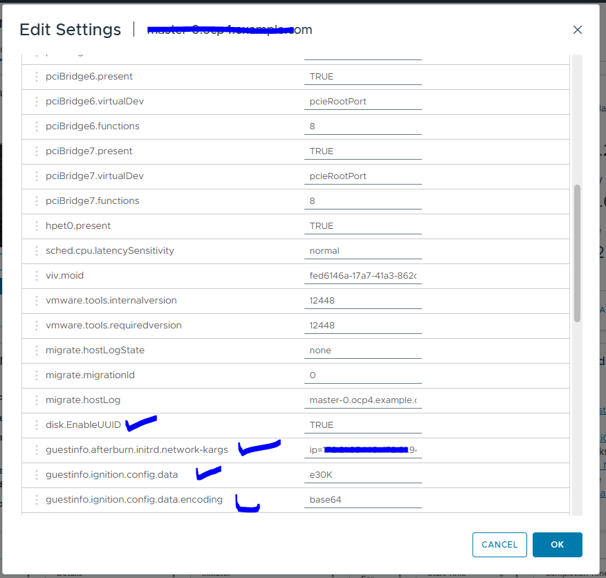

> **Figure 17.** VMware ESXi virtual machine configured with the required Ignition parameters.

The Ignition configuration is injected before the first boot of each virtual machine. During startup, RHCOS reads these parameters and automatically configures the operating system as required for the OpenShift installation.

### Notes

- Assign the correct Ignition file to each virtual machine.
- Verify that `guestinfo.ignition.config.data` contains the correct Base64-encoded content.
- Set `guestinfo.ignition.config.data.encoding` to `base64`.
- Apply the configuration before powering on the virtual machines.
- Incorrect Ignition parameters may prevent the node from joining the OpenShift cluster.
---

### Step 08: Bootstrap Node Initialization

Power on the bootstrap virtual machine to begin the OpenShift cluster installation. During this phase, the bootstrap node initializes the temporary control plane services required to deploy the Kubernetes control plane.

### Start the Bootstrap Process

Start the bootstrap virtual machine and monitor the installation progress from the bastion host.

### Commands

```bash
openshift-install wait-for bootstrap-complete \
    --dir=~/ocp-install \
    --log-level=info
```

The installer continuously monitors the bootstrap process until the temporary control plane is successfully initialized.

### Output

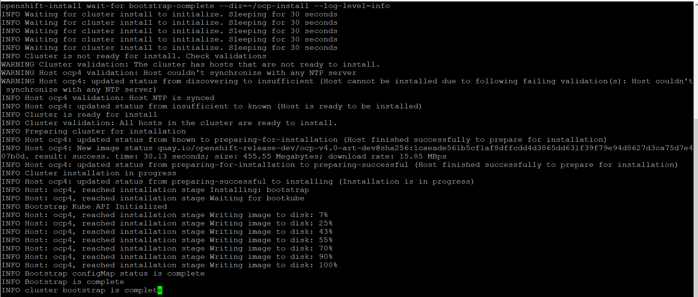

> **Figure 18.** OpenShift Installer monitoring the bootstrap node initialization process.

The bootstrap node initializes the Kubernetes control plane, Machine Config Operator, and other core cluster services required before the control plane nodes become fully operational.

### Notes

- Ensure the bootstrap virtual machine is powered on before running the installer.
- Monitor the installation logs for any errors during initialization.
- Verify that the bootstrap node can communicate with the control plane nodes.
- Do not power off the bootstrap node until the bootstrap process completes successfully.

---

### Step 09: Bootstrap Completion

Monitor the OpenShift bootstrap process until the temporary bootstrap control plane completes successfully. Bootstrap completion confirms that the permanent control plane nodes are ready to take over the required cluster services.

### Monitor Bootstrap Completion

Run the OpenShift Installer from the bastion host and wait for the bootstrap process to complete.

### Commands

```bash
openshift-install wait-for bootstrap-complete \
    --dir=~/ocp-install \
    --log-level=info
```

### Expected Result

After the bootstrap process completes successfully, the installer reports that the bootstrap resources can safely be removed.

```text
INFO It is now safe to remove the bootstrap resources
```

### Output

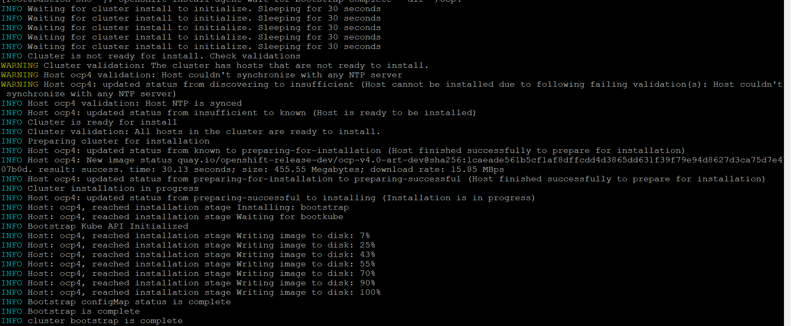

> **Figure 19.** Successful completion of the OpenShift bootstrap process, confirming that the bootstrap resources can safely be removed.

The successful bootstrap completion indicates that the permanent control plane has taken over the required cluster services and the temporary bootstrap node is no longer required.

---

### Remove Bootstrap Node from HAProxy

After successful bootstrap completion, remove or disable the bootstrap node entries from the HAProxy backends.

### Commands

```bash
sudo vi /etc/haproxy/haproxy.cfg

sudo haproxy -c -f /etc/haproxy/haproxy.cfg

sudo systemctl reload haproxy
```

Verify that the HAProxy configuration is valid and the service remains operational.

```bash
sudo systemctl status haproxy
```

### Notes

- Do not remove the bootstrap node before the installer confirms successful bootstrap completion.
- Save the bootstrap completion output as installation evidence.
- After successful completion, remove the bootstrap server entries from the HAProxy configuration.
- Validate the HAProxy configuration before reloading the service.
- The bootstrap virtual machine can be powered off after successful bootstrap completion.
---

### Step 10: Deploy Control Plane Nodes

Deploy the three OpenShift control plane nodes that provide the Kubernetes API, etcd, scheduler, controller manager, and other critical control plane services.

The control plane nodes use the generated `master.ign` Ignition configuration during their initial boot.

### Control Plane Nodes

| Node | Role | Ignition Configuration |
|------|------|------------------------|
| master-0 | Control Plane | `master.ign` |
| master-1 | Control Plane | `master.ign` |
| master-2 | Control Plane | `master.ign` |

---

### Power On Control Plane Nodes

Power on all three control plane virtual machines from VMware vSphere ESXi.

The nodes will boot using RHCOS and automatically apply the previously injected `master.ign` configuration.

### Output

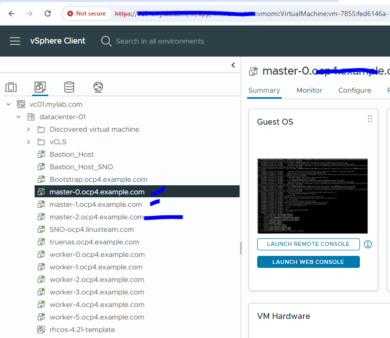

> **Figure 20.** Three OpenShift control plane virtual machines deployed and powered on in the VMware vSphere environment.

---

### Monitor Control Plane Nodes

From the bastion host, verify that the control plane nodes are joining the cluster.

### Commands

```bash
export KUBECONFIG=~/ocp-install/auth/kubeconfig

oc get nodes
```

During initialization, the control plane nodes may initially appear as `NotReady`.

```bash
oc get nodes -o wide
```

Continue monitoring until all control plane nodes become available.

### Expected Result

```text
NAME       STATUS   ROLES                  AGE   VERSION
master-0   Ready    control-plane,master   ...   ...
master-1   Ready    control-plane,master   ...   ...
master-2   Ready    control-plane,master   ...   ...
```

> **Note:** The exact Kubernetes version, IP addresses, and node age will depend on the deployed environment.

---

### Verify Control Plane Health

Verify the status of the control plane nodes.

### Commands

```bash
oc get nodes -l node-role.kubernetes.io/master

oc get nodes -o wide
```

The three control plane nodes should eventually report a `Ready` status after the required cluster services and MachineConfig have been applied.

### Notes

- All three control plane nodes use the same generated `master.ign` configuration.
- Ensure the control plane nodes can communicate with the API VIP and each other.
- Do not proceed with cluster validation until the control plane nodes have successfully joined the cluster.
- Nodes can temporarily report `NotReady` during initial configuration.
- Verify DNS, HAProxy, networking, and Ignition configuration if a control plane node fails to join.

---

### Step 11: Deploy Worker Nodes

Deploy the OpenShift worker nodes that will provide the compute capacity required to run application workloads, platform services, and other cluster components.

The worker nodes use the generated `worker.ign` Ignition configuration during their initial boot.

### Worker Nodes

| Node | Role | Ignition Configuration |
|------|------|------------------------|
| worker-0 | Worker | `worker.ign` |
| worker-1 | Worker | `worker.ign` |
| worker-2 | Worker | `worker.ign` |
| worker-3 | Worker | `worker.ign` |
| worker-4 | Worker | `worker.ign` |
| worker-5 | Worker | `worker.ign` |

---

### Power On Worker Nodes

Power on the worker virtual machines from VMware vSphere ESXi.

During the first boot, RHCOS reads the previously injected `worker.ign` configuration and begins the process of joining each worker node to the OpenShift cluster.

### Output

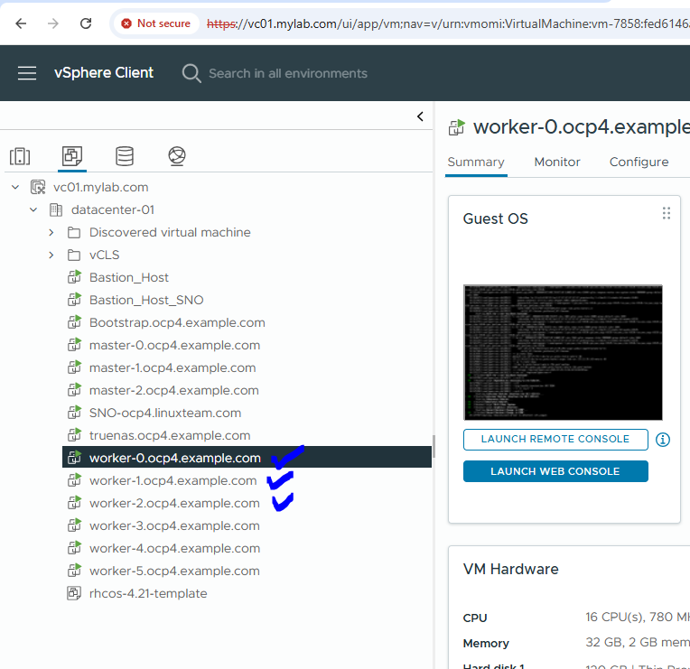

> **Figure 21.** OpenShift worker virtual machines deployed and powered on in the VMware vSphere environment.

---

### Monitor Worker Node Registration

From the bastion host, monitor the Certificate Signing Requests (CSRs) generated by the new worker nodes.

### Commands

```bash
export KUBECONFIG=~/ocp-install/auth/kubeconfig

oc get csr
```

New worker nodes may generate pending CSRs during the initial registration process.

### Expected Result

Pending certificate requests may appear similar to:

```text
NAME        AGE   SIGNERNAME                                    REQUESTOR
csr-xxxxx   ...   kubernetes.io/kube-apiserver-client-kubelet   system:serviceaccount:openshift-machine-config-operator:node-bootstrapper
```

The pending CSRs must be reviewed and approved before the worker nodes can fully join the cluster.

### Notes

- All worker nodes use the generated `worker.ign` configuration.
- Ensure each worker VM is connected to the correct network and has the expected static IP configuration.
- Verify DNS resolution and connectivity to the API endpoint if a worker node fails to register.
- Worker nodes can initially remain `NotReady` while certificates and MachineConfig are being processed.
- Review CSR requests before approval and confirm that they belong to the expected cluster nodes.

---

### Step 12: Certificate Signing Request (CSR) Approval

During the initial registration of new worker nodes, OpenShift generates Certificate Signing Requests (CSRs) for secure communication between the kubelet and the Kubernetes API server.

In a User-Provisioned Infrastructure (UPI) deployment, these CSRs must be reviewed and approved so that the worker nodes can successfully join the cluster.

### Check Pending CSRs

From the bastion host, verify the pending Certificate Signing Requests.

### Commands

```bash
export KUBECONFIG=~/ocp-install/auth/kubeconfig

oc get csr
```

Review the output and identify the CSRs with the `Pending` status.

### Output

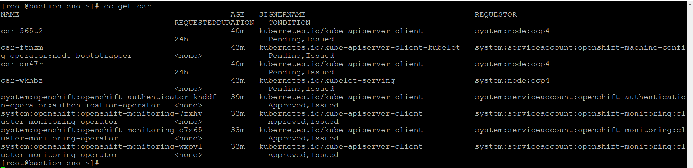

> **Figure 22.** Pending Certificate Signing Requests generated during worker node registration.

---

### Approve Pending CSRs

After verifying that the requests belong to the expected OpenShift nodes, approve the pending CSRs.

### Commands

```bash
oc get csr
```

Approve an individual CSR:

```bash
oc adm certificate approve <csr-name>
```

For multiple verified pending CSRs, approve them as required.

```bash
oc get csr --no-headers | awk '$5=="Pending" {print $1}' | \
xargs -r oc adm certificate approve
```

> **Important:** Review the CSR requestors before bulk approval and confirm that the requests originate from expected cluster nodes.

### Output

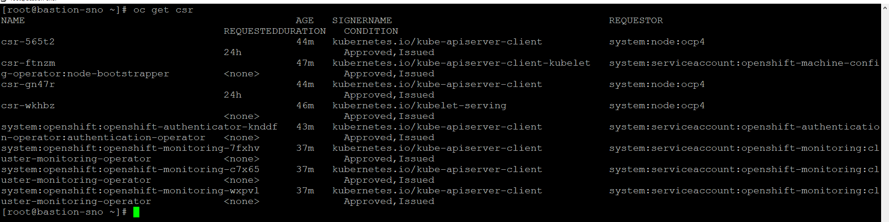

> **Figure 23.** Approval of verified Certificate Signing Requests for OpenShift nodes.

---

### Verify CSR Status

After approval, verify that the Certificate Signing Requests have transitioned from `Pending` to `Approved,Issued`.

### Commands

```bash
oc get csr
```

### Expected Result

```text
NAME        AGE   SIGNERNAME                                    REQUESTOR     CONDITION
csr-xxxxx   ...   kubernetes.io/kube-apiserver-client-kubelet   ...           Approved,Issued
```

### Output


> **Figure 24.** Certificate Signing Requests successfully approved and certificates issued to the OpenShift nodes.

Successful CSR approval allows the kubelet on each node to establish trusted communication with the OpenShift control plane and continue the node registration process.

### Notes

- Always inspect pending CSRs before approving them.
- Verify that CSR requestors correspond to expected OpenShift nodes or bootstrap identities.
- New nodes can generate more than one CSR during the registration process.
- Re-run `oc get csr` after a short interval to check whether additional CSRs require approval.
- If a node remains `NotReady` after CSR approval, verify its networking, DNS, Ignition, kubelet, and MachineConfig status.

---

### Step 13: Verify Cluster Nodes

After approving the required Certificate Signing Requests (CSRs), verify that all control plane and worker nodes have successfully joined the OpenShift cluster and reached the `Ready` state.

### Verify Node Status

Run the following command from the bastion host.

### Commands

```bash
export KUBECONFIG=~/ocp-install/auth/kubeconfig

oc get nodes
```

All expected control plane and worker nodes should appear in the cluster.

### Output

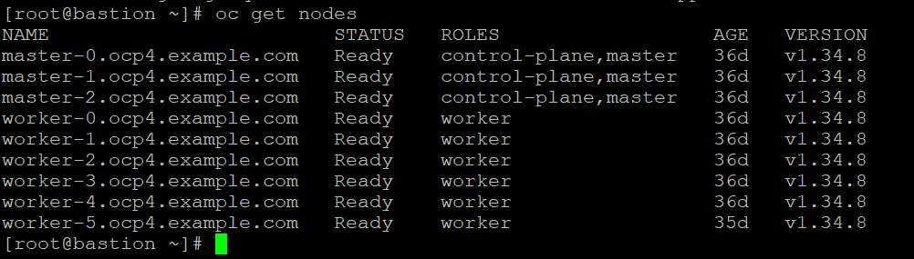

> **Figure 25.** OpenShift control plane and worker nodes successfully registered with the cluster and reporting a `Ready` status.

---

### Verify Detailed Node Information

Display additional information including internal IP addresses, node roles, operating system, and Kubernetes version.

### Commands

```bash
oc get nodes -o wide
```

### Output

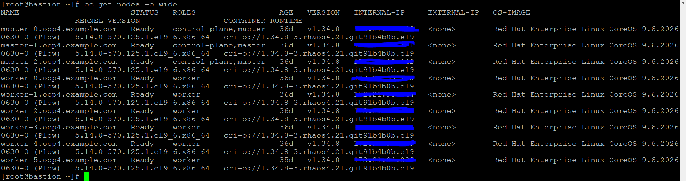

> **Figure 26.** Detailed validation of OpenShift cluster nodes including node roles, internal IP addresses, operating system, container runtime, and Kubernetes version.

### Expected Result

The cluster should contain the expected control plane and worker nodes with a `Ready` status.

```text
NAME       STATUS   ROLES                  AGE   VERSION
master-0   Ready    control-plane,master   ...   ...
master-1   Ready    control-plane,master   ...   ...
master-2   Ready    control-plane,master   ...   ...
worker-0   Ready    worker                 ...   ...
worker-1   Ready    worker                 ...   ...
worker-2   Ready    worker                 ...   ...
worker-3   Ready    worker                 ...   ...
worker-4   Ready    worker                 ...   ...
worker-5   Ready    worker                 ...   ...
```

> **Note:** The number of worker nodes, Kubernetes version, node age, and IP addresses will depend on the deployed environment.

---

### Verify Node Roles

Confirm that the appropriate roles are assigned to the control plane and worker nodes.

### Commands

```bash
oc get nodes \
    -L node-role.kubernetes.io/master,node-role.kubernetes.io/worker
```

The control plane nodes should have the `master` / `control-plane` role and compute nodes should have the `worker` role.

### Validation

- All control plane nodes are present.
- All expected worker nodes are present.
- Every node reports `Ready`.
- Node roles are assigned correctly.
- Internal IP addresses match the planned network configuration.
- Kubernetes versions are consistent across the cluster.

### Notes

- A node reporting `NotReady` should be investigated before proceeding.
- Check pending CSRs with `oc get csr` if a newly deployed node does not become `Ready`.
- Verify DNS, network connectivity, kubelet, and MachineConfig status when troubleshooting node registration issues.
- All expected nodes should reach a stable `Ready` state before the cluster is considered healthy.

---

### Step 14: Verify Cluster Operators

After verifying that all cluster nodes are in the `Ready` state, validate the health of the OpenShift Cluster Operators.

Cluster Operators manage the core platform components such as authentication, networking, ingress, monitoring, storage, DNS, the API server, and the Machine Config Operator.

### Verify Cluster Operator Status

Run the following command from the bastion host.

### Commands

```bash
export KUBECONFIG=~/ocp-install/auth/kubeconfig

oc get co
```

### Output

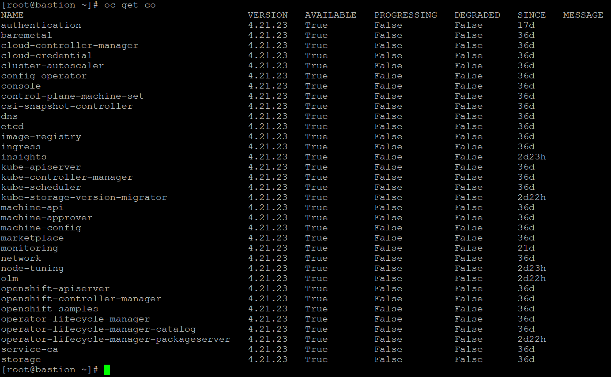

> **Figure 27.** OpenShift Cluster Operators reporting their availability, progressing, and degraded status after cluster deployment.

---

### Expected Result

For a healthy and stable OpenShift cluster, Cluster Operators should normally report:

```text
AVAILABLE   PROGRESSING   DEGRADED
True        False         False
```

The important status fields are:

| Status | Expected Value | Description |
|--------|----------------|-------------|
| Available | `True` | Operator is available and functioning |
| Progressing | `False` | Operator is not performing an ongoing rollout or update |
| Degraded | `False` | Operator is not reporting a degraded condition |

---

### Check Degraded Operators

Verify whether any Cluster Operator is reporting a degraded condition.

### Commands

```bash
oc get co | grep -v "True.*False.*False"
```

If an operator requires further investigation, inspect its detailed status.

```bash
oc describe co <operator-name>
```

For example:

```bash
oc describe co network
```

---

### Validation

- All expected Cluster Operators are present.
- `AVAILABLE` is `True`.
- `PROGRESSING` is `False` after the cluster has stabilized.
- `DEGRADED` is `False`.
- No operator reports persistent errors or unavailable platform components.

### Notes

- Some operators can temporarily report `Progressing=True` during initial cluster installation.
- Allow sufficient time for operators to stabilize after the control plane and worker nodes become available.
- Persistent `Degraded=True` conditions should be investigated before the cluster is considered healthy.
- Use `oc describe co <operator-name>` to review detailed status messages for an unhealthy operator.

---

### Step 15: Verify Cluster Version

Verify the installed OpenShift Container Platform version and confirm that the cluster is running the expected release.

The Cluster Version Operator (CVO) manages OpenShift cluster version information and coordinates platform updates.

### Verify Cluster Version

Run the following command from the bastion host.

### Commands

```bash
export KUBECONFIG=~/ocp-install/auth/kubeconfig

oc get clusterversion
```

### Output

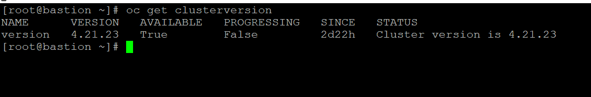

> **Figure 28.** Verification of the installed OpenShift Container Platform version and ClusterVersion status.

---

### Expected Result

A successfully installed cluster should display the active OpenShift release and indicate that no update is currently progressing.

Example:

```text
NAME      VERSION    AVAILABLE   PROGRESSING   SINCE   STATUS
version   4.21.21    True        False         ...     Cluster version is 4.21.21
```

> **Note:** The exact version and status message depend on the OpenShift release deployed in the environment.

---

### Verify Detailed Cluster Version Information

Display additional ClusterVersion information for further validation.

### Commands

```bash
oc describe clusterversion version
```

This provides detailed information about the current release, update history, available updates, and ClusterVersion conditions.

### Validation

- The expected OpenShift version is installed.
- `AVAILABLE` reports `True`.
- `PROGRESSING` reports `False` after the cluster has stabilized.
- No ClusterVersion errors are reported.
- The installed release matches the intended OpenShift deployment version.

### Notes

- The ClusterVersion Operator manages OpenShift release updates.
- `Progressing=True` can temporarily appear during installation or an upgrade.
- Investigate any persistent ClusterVersion error before considering the platform fully healthy.
- Cluster Operators should also be healthy before performing a future OpenShift upgrade.

---

### Step 16: Access OpenShift Web Console

After validating the cluster nodes, Cluster Operators, and OpenShift version, access the OpenShift Web Console to verify that the cluster is available through the graphical management interface.

The OpenShift Web Console provides a centralized interface for managing cluster resources, workloads, operators, networking, storage, monitoring, and other platform components.

### Get the OpenShift Console URL

Run the following command from the bastion host to retrieve the OpenShift Web Console URL.

### Commands

```bash
export KUBECONFIG=~/ocp-install/auth/kubeconfig

oc whoami --show-console
```

### Expected Output

The command returns the OpenShift Web Console URL.

```text
https://console-openshift-console.apps.ocp4.example.com
```

> **Note:** The actual console URL depends on the cluster name and base domain configured during installation.

---

### Verify Console Route

Verify that the OpenShift Console route is available.

### Commands

```bash
oc get route console -n openshift-console
```

The console route should display the hostname used to access the OpenShift Web Console.

---

### Access the Web Console

Open the URL returned by `oc whoami --show-console` in a web browser and authenticate using a valid OpenShift user account.

For the initial installation, the temporary `kubeadmin` credentials can be retrieved from the installation directory if required.

```bash
cat ~/ocp-install/auth/kubeadmin-password
```

> **Security Note:** Never publish the `kubeadmin` password, authentication tokens, pull secrets, private keys, or other credentials in screenshots or a public GitHub repository.

### Output

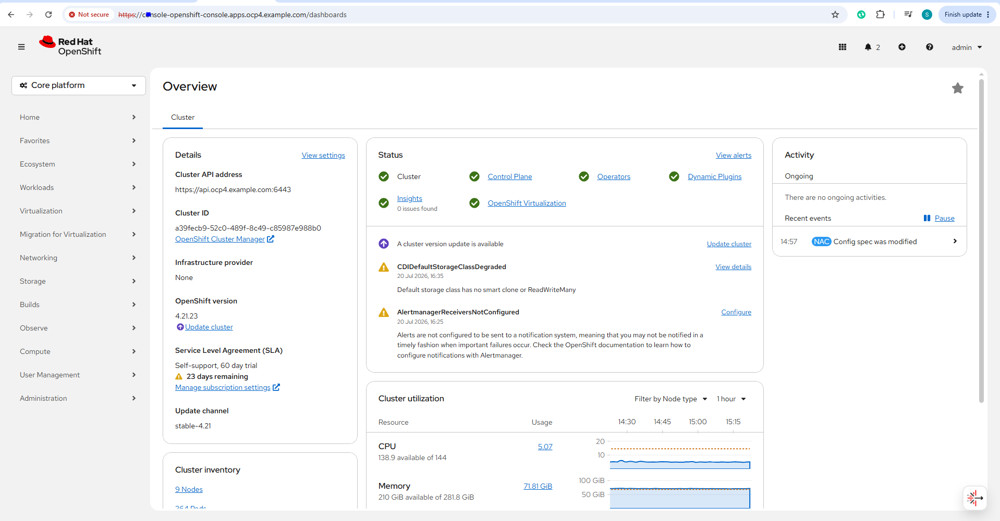

> **Figure 29.** Successfully authenticated OpenShift Web Console showing the deployed OpenShift Container Platform cluster.

The successful Web Console login confirms that the console route, ingress services, authentication components, and application wildcard DNS are functioning correctly.

### Validation

- OpenShift Console URL resolves successfully.
- Console route is available.
- Web Console loads successfully in the browser.
- Authentication is successful.
- Cluster dashboard is accessible.
- No critical cluster health warnings are present.

### Notes

- Ensure the wildcard `*.apps` DNS record resolves correctly.
- Verify the Ingress Operator if the console route is inaccessible.
- Use `oc get co console authentication ingress` when troubleshooting console access.
- Replace the temporary `kubeadmin` account with enterprise identity-provider authentication for long-term administration.
- Never expose credentials or authentication tokens in GitHub screenshots.
---

## ✅ Final Validation

After completing the OpenShift installation, perform a final validation to confirm that the cluster is fully operational and ready for Day-2 configuration and workloads.

### Verify Cluster Nodes

Confirm that all control plane and worker nodes are in the `Ready` state.

```bash
oc get nodes -o wide
```

### Verify Cluster Operators

Confirm that all Cluster Operators are healthy.

```bash
oc get co
```

For a stable cluster, the expected operator status is:

```text
AVAILABLE   PROGRESSING   DEGRADED
True        False         False
```

### Verify OpenShift Cluster Version

```bash
oc get clusterversion
```

Confirm that the cluster is running the expected OpenShift release and is not reporting an installation or update failure.

### Verify Pending CSRs

```bash
oc get csr
```

Confirm that no expected node Certificate Signing Requests remain pending.

### Verify API Access

```bash
oc whoami

oc get --raw='/readyz?verbose'
```

A successful response confirms connectivity to the Kubernetes API server and its readiness checks.

### Verify OpenShift Web Console

```bash
oc whoami --show-console
```

Confirm that the returned console URL is accessible from a web browser.

---

### Final Cluster Health Check

Run the primary validation commands together for a final overview of the deployed environment.

```bash
echo "===== CLUSTER NODES ====="
oc get nodes

echo
echo "===== CLUSTER OPERATORS ====="
oc get co

echo
echo "===== CLUSTER VERSION ====="
oc get clusterversion

echo
echo "===== PENDING CSRs ====="
oc get csr | grep Pending || echo "No Pending CSRs"

echo
echo "===== WEB CONSOLE ====="
oc whoami --show-console
```

### Output

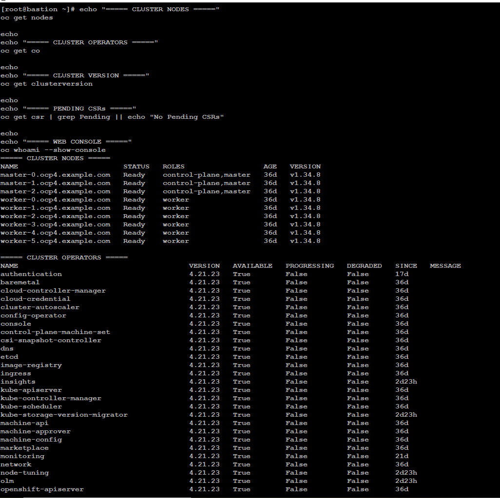

> **Figure 30.** Final validation of the OpenShift cluster confirming node readiness, Cluster Operator health, installed OpenShift version, CSR status, and Web Console availability.

### Validation Summary

| Validation | Expected Status |
|------------|-----------------|
| Control Plane Nodes | `Ready` |
| Worker Nodes | `Ready` |
| Cluster Operators | `Available=True` |
| Cluster Operators | `Progressing=False` |
| Cluster Operators | `Degraded=False` |
| Cluster Version | Expected OpenShift 4.21 release |
| Pending CSRs | None expected |
| Kubernetes API | Ready |
| Web Console | Accessible |

### Installation Status

> ✅ **OpenShift Container Platform 4.21 UPI deployment completed successfully on VMware vSphere ESXi.**

The cluster has successfully passed infrastructure, node, operator, API, and Web Console validation and is ready for Day-2 platform configuration and enterprise workloads.

---

## 📚 Lessons Learned

- Successfully deployed a production-style Red Hat OpenShift 4.21 UPI cluster.
- Configured enterprise networking using HAProxy and Windows Active Directory DNS.
- Deployed and validated bootstrap, control plane, and worker nodes.
- Verified overall cluster health and operator status.
- Built a reusable enterprise deployment methodology.

---

## 📖 References

- Red Hat OpenShift Container Platform Documentation
- OpenShift Installation Guide
- VMware vSphere Documentation
- HAProxy Documentation
- Red Hat Enterprise Linux Documentation
- Kubernetes Documentation
