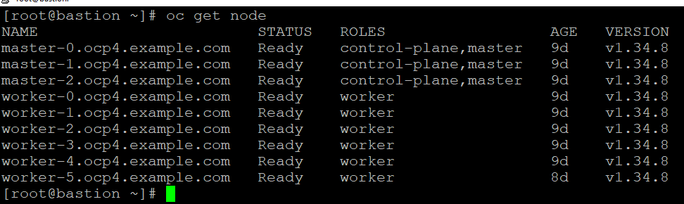
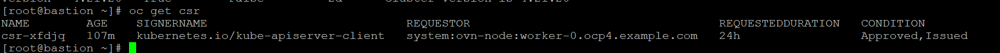
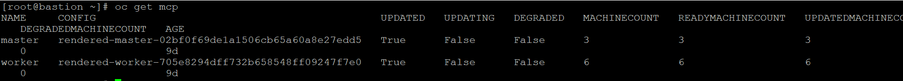
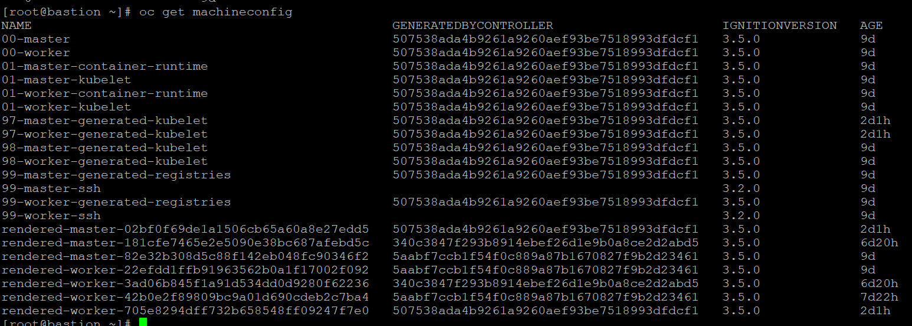
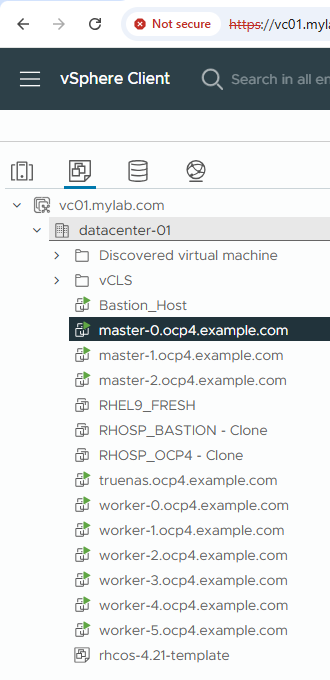

# Worker Node Integration

## Objective

This project demonstrates how a new worker node was successfully added to an existing Red Hat OpenShift 4.21 production cluster running on VMware vSphere.

The implementation covers:

- Worker VM deployment on VMware ESXi
- Ignition bootstrap
- CSR approval
- Node registration
- MachineConfigPool synchronization
- MachineConfig verification
- Cluster health validation

---

# Environment

| Component | Version |
|-----------|----------|
| OpenShift | 4.21.21 |
| Kubernetes | 1.34 |
| VMware ESXi | 8.x |
| OS | RHCOS |
| Installation | UPI |

---

# Architecture

```
                 VMware ESXi
                      │
                      ▼
          New Worker Virtual Machine
                      │
                Ignition Bootstrap
                      │
                      ▼
             Certificate Signing Request
                      │
               Manual CSR Approval
                      │
                      ▼
              Worker joins Cluster
                      │
                      ▼
        MachineConfig applied automatically
                      │
                      ▼
             Ready Scheduling Node
```

---

# Workflow

1. Create Worker VM
2. Attach Ignition
3. Boot Worker
4. Generate CSR
5. Approve CSR
6. Worker joins cluster
7. MachineConfig applied
8. MachineConfigPool Updated
9. Cluster Ready

---

# Verification Commands

## Check Nodes

```bash
oc get nodes
```

## Check CSR

```bash
oc get csr
```

## Approve CSR

```bash
oc adm certificate approve <csr-name>
```

## MachineConfigPool

```bash
oc get mcp
```

## MachineConfig

```bash
oc get machineconfig
```

## Worker Details

```bash
oc describe node worker-5.ocp4.example.com
```

---

# Validation

## Worker Node Ready

The new worker node successfully joined the OpenShift cluster.



---

## CSR Approved

Certificate Signing Requests approved successfully.



---

## MachineConfigPool

MachineConfigPool reports the worker node as updated and healthy.



---

## MachineConfig

MachineConfig successfully applied.



---

## VMware Worker VM

Worker virtual machine running on VMware ESXi.



---

# Validation Commands

```bash
oc get nodes

oc get csr

oc get machineconfig

oc get mcp

oc describe node worker-5.ocp4.example.com

oc get co
```

---

# Outcome

Successfully completed:

- VMware Worker VM Deployment
- Ignition Configuration
- CSR Approval
- Worker Node Registration
- MachineConfig Synchronization
- MachineConfigPool Healthy
- Cluster Expansion
- Production Cluster Validation

---

# Skills Demonstrated

- Red Hat OpenShift Administration
- Kubernetes Administration
- VMware vSphere
- Worker Node Lifecycle
- MachineConfig Operator
- Certificate Management
- Cluster Expansion
- Production Troubleshooting

---

# References

- Red Hat OpenShift Documentation
- Kubernetes Documentation
- VMware vSphere Documentation
