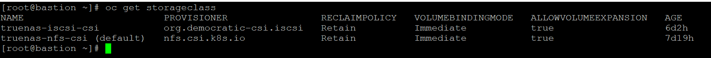
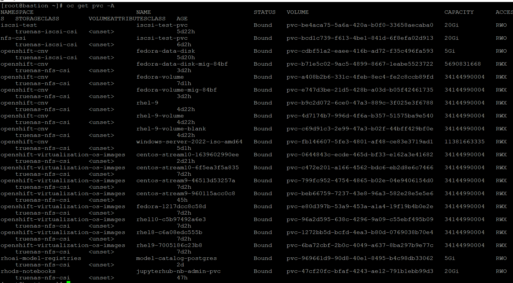
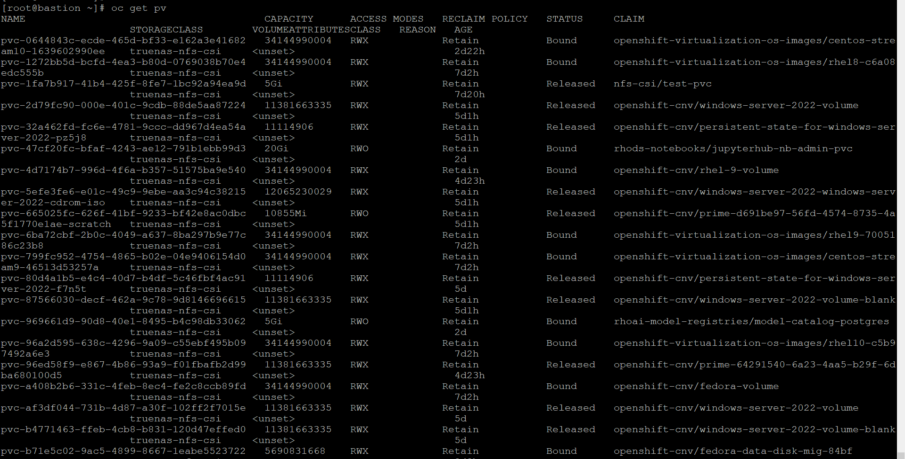
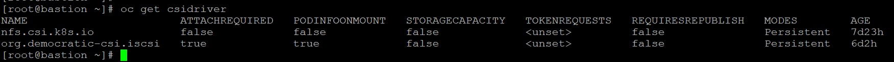
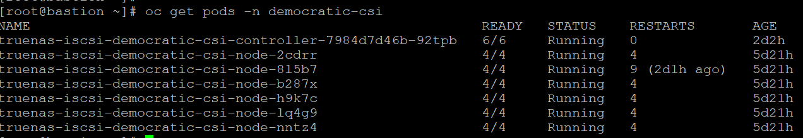
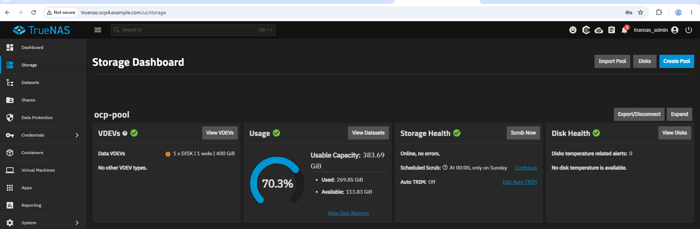

# TrueNAS CSI Storage Integration with OpenShift 4.21

---

# Project Overview

This document describes the implementation of dynamic storage provisioning for Red Hat OpenShift Container Platform (OCP) 4.21 using TrueNAS Community Edition.

The storage solution provides both NFS (RWX) and iSCSI (RWO) persistent storage using the democratic-csi driver.

---

# Objective

The objective of this project is to integrate enterprise-grade storage with OpenShift for persistent application data using CSI (Container Storage Interface).

---

# Lab Environment

| Component            | Details                   |
| -------------------- | ------------------------- |
| Platform             | VMware ESXi               |
| OpenShift Version    | 4.21                      |
| Storage Platform     | TrueNAS Community Edition |
| CSI Driver           | democratic-csi            |
| Protocols            | NFS & iSCSI               |
| Dynamic Provisioning | Enabled                   |

---

# Storage Architecture

```
Application
      │
      ▼
Persistent Volume Claim (PVC)
      │
      ▼
StorageClass
      │
      ▼
CSI Driver (democratic-csi)
      │
      ▼
TrueNAS
 ├── NFS (RWX)
 └── iSCSI (RWO)
```

---

# Storage Components

## TrueNAS

Enterprise NAS platform providing persistent storage.

## democratic-csi

CSI Driver used to provision storage dynamically.

## StorageClass

Defines storage provisioning policy.

## Persistent Volume (PV)

Automatically created after PVC request.

## Persistent Volume Claim (PVC)

Requested by applications for persistent storage.

---

# NFS Storage

### Features

* ReadWriteMany (RWX)
* Dynamic Provisioning
* Shared Storage
* Multiple Pods can access simultaneously

Example StorageClass

```yaml
provisioner: org.democratic-csi.nfs
```

---

# iSCSI Storage

### Features

* ReadWriteOnce (RWO)
* High Performance
* Block Storage
* Dedicated Volume

Example StorageClass

```yaml
provisioner: org.democratic-csi.iscsi
```

---

# Storage Validation

Verify StorageClass

```bash
oc get storageclass
```

Verify PVC

```bash
oc get pvc
```

Verify Persistent Volume

```bash
oc get pv
```

Verify CSI Driver

```bash
oc get csidriver
```

---

# Test Pod

Deploy a sample Pod using the PVC.

```bash
oc apply -f pvc.yaml

oc apply -f pod.yaml
```

Verify

```bash
oc get pods

oc describe pvc

oc exec -it <pod-name> -- df -h
```

---

# Troubleshooting

### PVC Pending

Check

```bash
oc describe pvc
```

### CSI Controller

```bash
oc get pods -n democratic-csi
```

### StorageClass

```bash
oc get storageclass
```

### CSI Driver

```bash
oc get csidriver
```

---

# Lessons Learned

* Validate TrueNAS connectivity before deployment.
* Verify CSI Controller is running.
* Use RWX for shared workloads.
* Use RWO for databases and block storage.
* Always validate StorageClass before creating PVCs.

---

# Interview Questions

### What is CSI?

### Difference between PV and PVC?

### Difference between NFS and iSCSI?

### Difference between RWX and RWO?

### Why use StorageClass?

### What happens when a PVC is created?

### How does dynamic provisioning work?

---
---

# Verification Screenshots

## Storage Classes

The OpenShift cluster is configured with multiple StorageClasses including TrueNAS CSI.



---

## Persistent Volume Claims

PVCs are dynamically provisioned and successfully reach the Bound state.



---

## Persistent Volumes

Persistent Volumes are automatically created by the CSI driver.



---

## CSI Driver

The TrueNAS CSI Driver is successfully registered in the cluster.



---

## CSI Controller

The CSI Controller pods are running without errors.



---

## TrueNAS Dashboard

The backend storage platform used for dynamic provisioning.



---

## OpenShift Storage Console

OpenShift storage resources visible from the web console.


# Final Result

✅ TrueNAS successfully integrated with OpenShift

✅ Dynamic Storage Provisioning Working

✅ NFS RWX Storage Functional

✅ iSCSI RWO Storage Functional

✅ PVC Automatically Provisioned

✅ Storage Ready for Production Workloads
