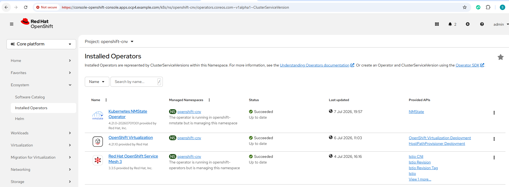
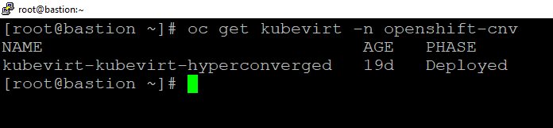
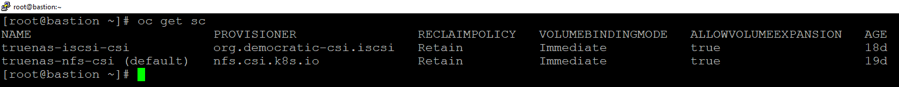
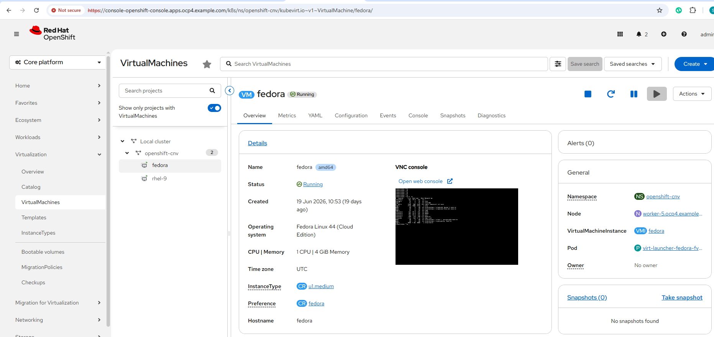
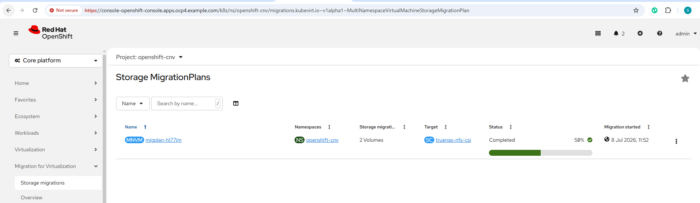
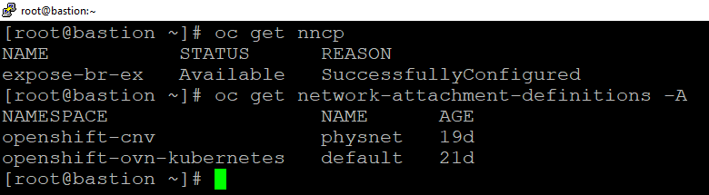
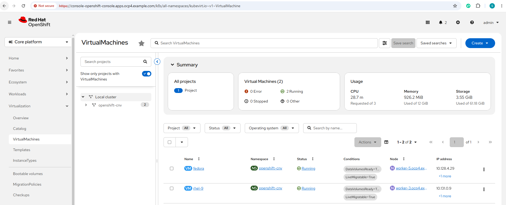
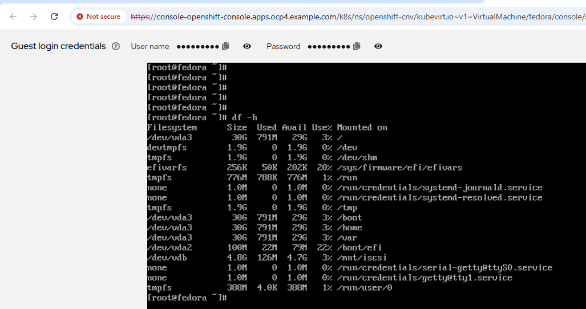
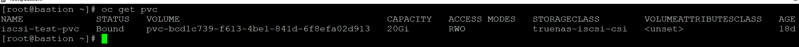
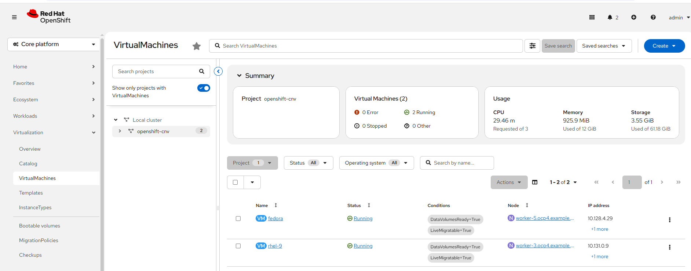

# OpenShift Virtualization (KubeVirt)

## Objective

This project demonstrates how to deploy and manage virtual machines on Red Hat OpenShift using OpenShift Virtualization (KubeVirt).

The implementation includes:

- OpenShift Virtualization Operator
- KubeVirt
- TrueNAS NFS CSI
- TrueNAS iSCSI CSI
- Dynamic Storage Provisioning
- Fedora Virtual Machine
- Live Migration
- Secondary Network
- VM Snapshots
- RWX and RWO Persistent Volumes

---

# Environment

| Component | Version |
|-----------|----------|
| OpenShift | 4.21.21 |
| Kubernetes | 1.34 |
| VMware ESXi | 8.x |
| OpenShift Virtualization | Latest |
| TrueNAS SCALE | 25.x |
| CSI Driver | TrueNAS CSI |
| Storage | NFS + iSCSI |

---

# Architecture

```
                     VMware ESXi
                           │
                           ▼
                OpenShift 4.21 Cluster
                           │
        ┌──────────────────┼──────────────────┐
        │                  │                  │
        ▼                  ▼                  ▼
 OpenShift           TrueNAS CSI       Secondary Bridge
 Virtualization      (NFS/iSCSI)          Network
        │                  │                  │
        └──────────────┬───┘                  │
                       ▼                      │
                 Fedora Virtual Machine ◄────┘
                       │
                       ▼
                Live Migration
```

---

# Features

- OpenShift Virtualization
- KubeVirt
- Fedora Virtual Machine
- Dynamic NFS Storage
- Dynamic iSCSI Storage
- RWX PVC
- RWO PVC
- Live Migration
- VM Snapshot
- Secondary Network
- Static IP Configuration
- VM Console Access
- SSH Access

---

# Installation Verification

Verify OpenShift Virtualization

```bash
oc get kubevirt -A
```

Verify Operator

```bash
oc get csv -n openshift-cnv
```

Verify CDI

```bash
oc get cdi
```

Verify Storage Classes

```bash
oc get sc
```

Verify PVC

```bash
oc get pvc -A
```

Verify Virtual Machines

```bash
oc get vm -A
```

---

# Storage Classes

```
truenas-nfs-csi
truenas-iscsi-csi
```

---

# Virtual Machines

```
Fedora
RHEL 9
```

---

# Live Migration

Verified successfully.

Migration completed without downtime.

---

# Secondary Network

Configured using NMState.

Bridge Interface

```
br-ex
```

Verify

```bash
oc get nncp
```

---

# Screenshots

## 1. OpenShift Virtualization Operator



---

## 2. KubeVirt Deployment



---

## 3. Storage Classes



---

## 4. Fedora Virtual Machine



---

## 5. Live Migration



---

## 6. Secondary Network



---

## 7. Running Virtual Machine



---

## 8. VM Console



---

## 9. Persistent Volume Claim



---

## 10. Snapshot



---

# Validation Commands

```bash
oc get kubevirt -A

oc get vm -A

oc get vmi -A

oc get pvc -A

oc get sc

oc get storageprofile

oc get cdi

oc get nncp

oc get pods -n openshift-cnv
```

---

# Outcome

Successfully implemented:

- OpenShift Virtualization
- KubeVirt
- Fedora Virtual Machine
- Dynamic NFS Storage
- Dynamic iSCSI Storage
- Live Migration
- Secondary Network
- RWX Storage
- RWO Storage
- VM Snapshots
- Enterprise Virtualization Platform

---

# References

- Red Hat OpenShift Virtualization Documentation
- KubeVirt Documentation
- TrueNAS CSI Documentation
