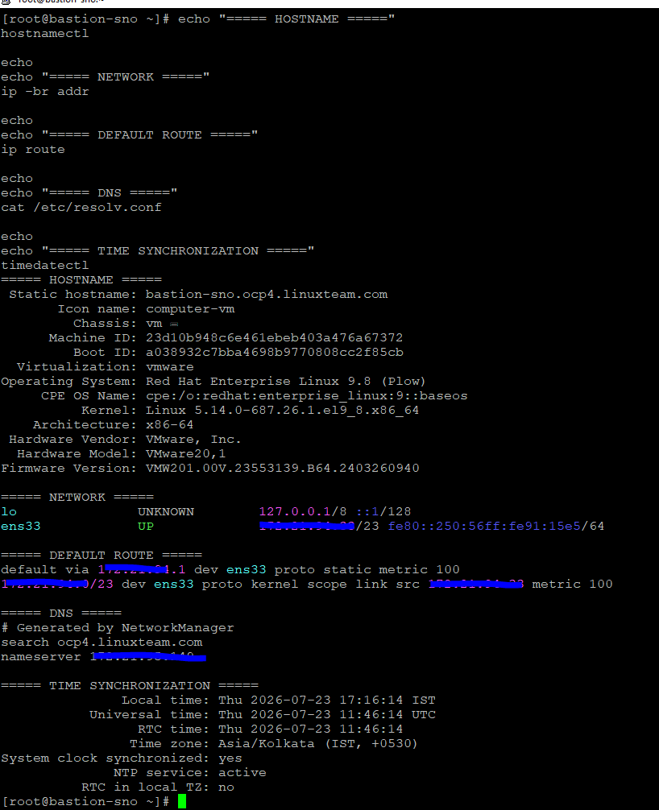
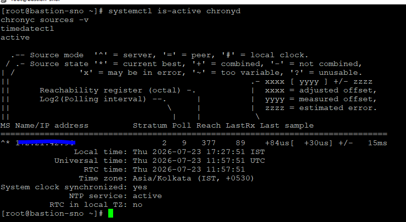
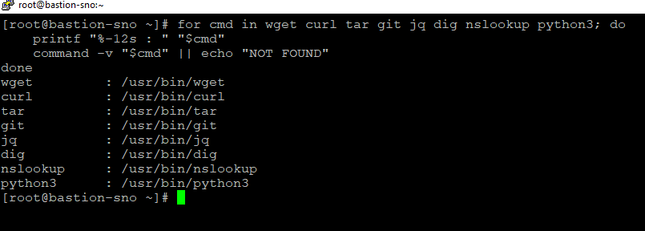

# 🚀 Red Hat OpenShift 4.21 Single Node OpenShift (SNO) on VMware vSphere

> Production-style deployment of Red Hat OpenShift Container Platform 4.21 Single Node OpenShift (SNO) using the Agent-Based Installer on VMware vSphere ESXi.

---

## 📖 Overview

This project documents the complete deployment of Red Hat OpenShift Container Platform (OCP) 4.21 as a Single Node OpenShift (SNO) cluster on VMware vSphere ESXi using the Agent-Based Installer.

Single Node OpenShift combines the control plane and compute workloads on a single OpenShift node, making it suitable for edge computing, remote locations, development environments, testing, and infrastructure-constrained deployments.

This guide is based on an actual hands-on lab deployment and includes real commands, configuration files, screenshots, validation procedures, troubleshooting steps, and implementation notes.

---

## 🎯 Objectives

- Deploy OpenShift 4.21 Single Node OpenShift on VMware ESXi.
- Use the OpenShift Agent-Based Installer.
- Configure static IP addressing for the SNO node.
- Configure forward, reverse, API, and application DNS records.
- Generate `install-config.yaml` and `agent-config.yaml`.
- Generate the Agent ISO.
- Deploy and boot the SNO virtual machine on VMware ESXi.
- Monitor host discovery and installation validations.
- Troubleshoot Agent-Based Installer validation failures.
- Complete bootstrap and cluster installation.
- Validate the OpenShift node, Cluster Operators, and ClusterVersion.
- Access and validate the OpenShift Web Console.

---

## 🏗 High-Level Architecture

```text
                  VMware vSphere ESXi
                          │
          ┌───────────────┴───────────────┐
          │                               │
          ▼                               ▼
   Bastion Host                     SNO Node
172.21.94.33                      172.21.94.34
          │                               │
          │                        ┌──────┴──────┐
          │                        │             │
 OpenShift Installer          Control Plane   Worker
 oc / kubectl                     + etcd      Workloads
          │                              │
          └──────────────────────────────┘
                         │
                         ▼
              OpenShift 4.21 SNO
```

---

## 🖥 Lab Environment

| Item | Value |
|------|-------|
| OpenShift Version | 4.21.x |
| Installation Type | Agent-Based Installer |
| Cluster Type | Single Node OpenShift (SNO) |
| Hypervisor | VMware ESXi |
| Base Domain | `linuxteam.com` |
| Cluster Name | `ocp4` |
| Bastion Host | `bastion-sno.ocp4.linuxteam.com` |
| Bastion IP | `172.21.94.33` |
| OpenShift Node | `ocp4.linuxteam.com` |
| SNO Node IP | `172.21.94.34` |
| DNS Server | `172.21.95.149` |
| Gateway | `172.21.94.1` |
| Machine Network | `172.21.94.0/23` |
| Network Configuration | Static IP |

---

## 📋 Deployment Workflow

```text
Lab Preparation
       │
       ▼
Bastion Host Preparation
       │
       ▼
DNS Configuration
       │
       ▼
OpenShift Client & Installer
       │
       ▼
SSH Key & Pull Secret
       │
       ▼
Create install-config.yaml
       │
       ▼
Create agent-config.yaml
       │
       ▼
Generate Agent ISO
       │
       ▼
Create VMware SNO VM
       │
       ▼
Boot from Agent ISO
       │
       ▼
Agent Discovery
       │
       ▼
Agent Validation
       │
       ▼
Bootstrap
       │
       ▼
Installation Complete
       │
       ▼
Cluster Validation
       │
       ▼
OpenShift Web Console
```

---

## 📑 Table of Contents

- [Overview](#-overview)
- [Objectives](#-objectives)
- [High-Level Architecture](#-high-level-architecture)
- [Lab Environment](#-lab-environment)
- [Deployment Workflow](#-deployment-workflow)
- [Installation Guide](#-installation-guide)
  - [Step 01: Lab Preparation](#step-01-lab-preparation)
  - [Step 02: Bastion Host Preparation](#step-02-bastion-host-preparation)
  - [Step 03: DNS Configuration](#step-03-dns-configuration)
  - [Step 04: Install OpenShift Client and Installer](#step-04-install-openshift-client-and-installer)
  - [Step 05: Configure SSH Key and Pull Secret](#step-05-configure-ssh-key-and-pull-secret)
  - [Step 06: Create install-config.yaml](#step-06-create-install-configyaml)
  - [Step 07: Create agent-config.yaml](#step-07-create-agent-configyaml)
  - [Step 08: Generate Agent ISO](#step-08-generate-agent-iso)
  - [Step 09: Create VMware SNO Virtual Machine](#step-09-create-vmware-sno-virtual-machine)
  - [Step 10: Boot SNO Node from Agent ISO](#step-10-boot-sno-node-from-agent-iso)
  - [Step 11: Verify Agent Discovery and Validations](#step-11-verify-agent-discovery-and-validations)
  - [Step 12: Monitor Bootstrap](#step-12-monitor-bootstrap)
  - [Step 13: Monitor Installation Completion](#step-13-monitor-installation-completion)
  - [Step 14: Configure Kubeconfig](#step-14-configure-kubeconfig)
  - [Step 15: Verify SNO Node](#step-15-verify-sno-node)
  - [Step 16: Verify Cluster Operators](#step-16-verify-cluster-operators)
  - [Step 17: Verify Cluster Version](#step-17-verify-cluster-version)
  - [Step 18: Access OpenShift Web Console](#step-18-access-openshift-web-console)
- [Final Validation](#-final-validation)
- [Troubleshooting](#-troubleshooting)
- [Lessons Learned](#-lessons-learned)
- [References](#-references)

---

# 🚀 Installation Guide

## Step 01: Lab Preparation

Before starting the Single Node OpenShift installation, verify the bastion host, network configuration, DNS resolver, default gateway, and system time.

This validation ensures that the infrastructure is ready before generating the Agent-Based Installer configuration.

### Lab Information

| Item | Value |
|------|-------|
| OpenShift Version | 4.21.x |
| Installation Type | Agent-Based Installer |
| Cluster Type | Single Node OpenShift (SNO) |
| Hypervisor | VMware ESXi |
| Base Domain | `linuxteam.com` |
| Cluster Name | `ocp4` |
| Bastion Host | `bastion-sno.ocp4.linuxteam.com` |
| Bastion IP | `172.21.94.33` |
| OpenShift Node | `ocp4.linuxteam.com` |
| SNO Node IP | `172.21.94.34` |
| DNS Server | `172.21.95.149` |
| Gateway | `172.21.94.1` |
| Machine Network | `172.21.94.0/23` |
| Network Configuration | Static IP |

---

### Verify Bastion Hostname

```bash
hostnamectl
```

Confirm that the bastion host is configured with the expected hostname:

```text
bastion-sno.ocp4.linuxteam.com
```

---

### Verify Bastion Network Configuration

```bash
ip -br addr
```

Confirm that the bastion host has the expected IP address:

```text
172.21.94.33
```

---

### Verify Default Gateway

```bash
ip route
```

Confirm that the default route points to:

```text
172.21.94.1
```

---

### Verify DNS Resolver

```bash
cat /etc/resolv.conf
```

Confirm that the configured DNS server is:

```text
172.21.95.149
```

---

### Verify Time Synchronization

```bash
timedatectl
```

Confirm that system time synchronization is enabled and the system clock is synchronized.

---

### Combined Pre-flight Validation

Run the following commands together to capture the complete bastion host pre-flight validation:

```bash
echo "===== HOSTNAME ====="
hostnamectl

echo
echo "===== NETWORK ====="
ip -br addr

echo
echo "===== DEFAULT ROUTE ====="
ip route

echo
echo "===== DNS ====="
cat /etc/resolv.conf

echo
echo "===== TIME SYNCHRONIZATION ====="
timedatectl
```

### Output



> **Figure 1.** Pre-flight validation of the SNO bastion host showing hostname, network configuration, default gateway, DNS resolver, and system time synchronization.

### Validation

- Bastion hostname is configured correctly.
- Bastion IP address is `172.21.94.33`.
- Default gateway is `172.21.94.1`.
- DNS resolver is `172.21.95.149`.
- System clock is synchronized.
- Bastion host has network connectivity required for the OpenShift installation.

### Notes

- Verify all network parameters before generating the Agent-Based Installer configuration.
- Incorrect DNS, gateway, or network configuration can cause Agent discovery and installation validation failures.
- Accurate time synchronization is important for certificates and communication between OpenShift components.

---

## Step 02: Bastion Host Preparation

Prepare the bastion host with the utilities required for the OpenShift 4.21 Single Node OpenShift deployment.

The bastion host will be used to generate the Agent-Based Installer ISO, manage installation configuration files, monitor the installation, and administer the SNO cluster.

### Install Required Packages

Update the bastion host and install the required utilities.

```bash
sudo dnf update -y

sudo dnf install -y \
wget \
curl \
tar \
git \
jq \
bind-utils \
chrony \
python3
```

### Output


> **Figure 2.** Required packages installed successfully on the SNO bastion host.

---

### Enable Time Synchronization

Enable and start the Chrony service.

```bash
sudo systemctl enable --now chronyd
```

Verify the service status:

```bash
systemctl is-active chronyd
```

Expected result:

```text
active
```

Verify the configured time sources:

```bash
chronyc sources -v
```

Verify system time synchronization:

```bash
timedatectl
```

### Output



> **Figure 3.** Chrony service and system time synchronization verified on the bastion host.

---

### Verify Required Utilities

Confirm that the required commands are available.

```bash
for cmd in wget curl tar git jq dig nslookup python3; do
    printf "%-12s : " "$cmd"
    command -v "$cmd" || echo "NOT FOUND"
done
```

### Expected Result

Each required utility should return its installed executable path.

Example:

```text
wget         : /usr/bin/wget
curl         : /usr/bin/curl
tar          : /usr/bin/tar
git          : /usr/bin/git
jq           : /usr/bin/jq
dig          : /usr/bin/dig
nslookup     : /usr/bin/nslookup
python3      : /usr/bin/python3
```

### Output



> **Figure 4.** Verification of the utilities required for the Agent-Based SNO installation.

---

### Validation

- Required bastion packages are installed.
- Chrony service is enabled and running.
- System time is synchronized.
- `wget`, `curl`, `tar`, `git`, and `jq` are available.
- `dig` and `nslookup` are available for DNS troubleshooting.
- Python 3 is available.
- Bastion host is ready for the OpenShift installation tools.

### Notes

- `bind-utils` provides `dig` and `nslookup`, which will be used extensively during DNS validation.
- Accurate time synchronization is important for TLS certificates and OpenShift services.
- The OpenShift Client (`oc`), `kubectl`, and `openshift-install` binaries will be installed separately in the next installation-tools step.

---
---

## Step 03: DNS Configuration

> DNS records, validation commands, screenshots, and troubleshooting will be documented during the actual deployment.

---

## Step 04: Install OpenShift Client and Installer

> OpenShift 4.21 client and Agent-Based Installer installation will be documented here.

---

## Step 05: Configure SSH Key and Pull Secret

> SSH public key and Red Hat pull secret configuration will be documented here.

---

## Step 06: Create install-config.yaml

> The production `install-config.yaml` structure used by this SNO deployment will be documented here with sensitive information removed.

---

## Step 07: Create agent-config.yaml

> Static network configuration and SNO host configuration will be documented here.

---

## Step 08: Generate Agent ISO

> Agent ISO generation commands and validation will be documented here.

---

## Step 09: Create VMware SNO Virtual Machine

> VMware ESXi VM configuration, CPU, memory, disk, network adapter, and ISO configuration will be documented here.

---

## Step 10: Boot SNO Node from Agent ISO

> The first boot and Agent discovery process will be documented here.

---

## Step 11: Verify Agent Discovery and Validations

> Agent discovery status and installation validations will be checked before allowing installation to continue.

---

## Step 12: Monitor Bootstrap

> Bootstrap progress will be monitored using the Agent-Based Installer.

---

## Step 13: Monitor Installation Completion

> Installation will be monitored until the OpenShift Installer confirms successful completion.

---

## Step 14: Configure Kubeconfig

> Administrative access to the newly installed SNO cluster will be configured here.

---

## Step 15: Verify SNO Node

> Node status, roles, networking, and Kubernetes version will be validated here.

---

## Step 16: Verify Cluster Operators

> Cluster Operator availability and health will be validated here.

---

## Step 17: Verify Cluster Version

> The installed OpenShift 4.21 release and ClusterVersion status will be verified here.

---

## Step 18: Access OpenShift Web Console

> OpenShift Web Console accessibility and cluster dashboard will be validated here.

---

## ✅ Final Validation

The final validation will confirm:

- SNO node is `Ready`.
- Control-plane and worker roles are correctly assigned.
- Cluster Operators are healthy.
- ClusterVersion is available and stable.
- Kubernetes API is accessible.
- OpenShift Web Console is accessible.
- No unexpected pending CSRs remain.
- Cluster networking and DNS are functioning correctly.

---

## 🛠 Troubleshooting

Real installation issues encountered during this deployment will be documented here along with:

- Symptoms
- Error messages
- Root cause
- Diagnostic commands
- Resolution
- Final verification

This section will provide practical troubleshooting evidence rather than theoretical examples.

---

## 📚 Lessons Learned

Lessons learned during the SNO deployment will be documented after successful installation.

---

## 📖 References

- Red Hat OpenShift Container Platform Documentation
- Red Hat Agent-Based Installer Documentation
- Red Hat Single Node OpenShift Documentation
- VMware vSphere Documentation
